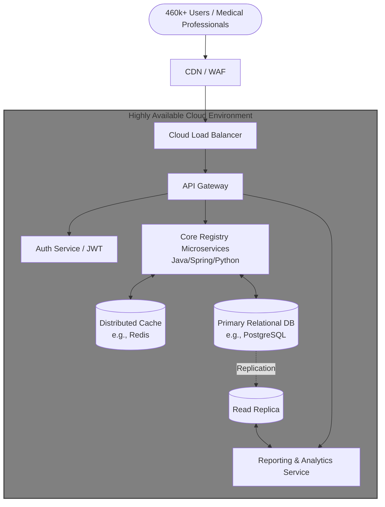
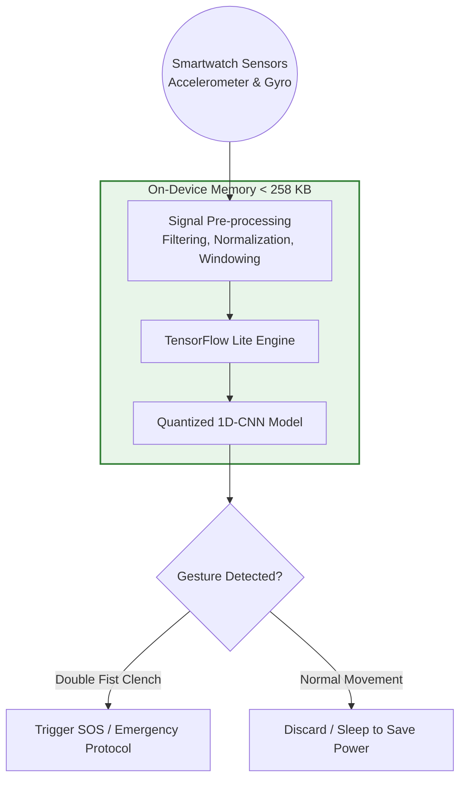

# 👤 Professional Profile: Lorenzo Giarè

This document summarizes my background, core competencies, and unique value proposition for the **Site Reliability Engineering, Google Warsaw** role. This is a personalized "pitch deck" version of my experience, designed to showcase my fit for the division.

---

## 🚀 Why I Am a Great Fit for Site Reliability Engineering at Google Warsaw

### 1. Massively Scalable Systems Experience
I have engineered systems designed for high-concurrency and massive user bases, such as the national institution registry for **FNOMCeO**, built to support **460,000+ users**. I understand the architectural rigor required to ensure that systems remain performant, consistent, fault-tolerant, and secure at a national scale.

### 2. Deep Technical Versatility & Debugging Instinct
My stack spans the entire development lifecycle, which gives me an edge in diagnosing complex issues that span multiple layers:
- **Backend & Systems**: Java (Spring), Python (Node.js/FastAPI), JavaEE, and Linux internals.
- **Infrastructure & Automation**: AWS, Docker, and Kubernetes.
- **Performance**: Edge Inference optimization, demonstrating an understanding of resource-constrained performance tuning and low-latency environments.

### 3. The Bridge Between Research & Production
As a **Researcher in Horizon Europe Projects**, I have a proven track record of taking cutting-edge concepts and translating them into robust, highly-available applications. SRE requires a strong engineering approach to operations, and my research background gives me the analytical rigor to tackle ambiguous, complex failures through data-driven investigation.

### 4. High-Capacity Grit
I have consistently balanced high-level professional responsibilities with academic excellence. I managed full-time engineering roles throughout my Master’s and Bachelor’s degrees, demonstrating the stamina, time-management skills, and incident-response readiness necessary for the fast-paced, high-stakes environment of Google Warsaw's SRE.

---

## 🎤 The "Elevator Pitch"

> "I am a Software Engineer with a deep obsession for building and maintaining intelligent, distributed, and highly reliable systems. My background is unique because I’ve spent the last 5 years building national-scale enterprise architectures while maintaining the analytical rigor of academic research. 
>
> I've built and optimized national registries supporting hundreds of thousands of users, and I treat operations as a software problem. I don't just write code; I architect ecosystems that are observable, fault-tolerant, and performant. I am passionate about Linux internals, automation, and distributed consensus, and I have the engineering maturity to ensure that Google's infrastructure maintains the exceptional reliability that customers expect."

---

## 🛠️ Key Technical Achievements & Project Deep Dives

### 1. FNOMCeO National Registry (Cloud Architecture & High Availability)
**What the project is about:**
The complete modernization and cloud architecture planning for the National Federation of the Orders of Surgeons and Dentists (FNOMCeO). The goal was to replace legacy infrastructure with a modern, highly available national institution registry capable of reliably supporting over **460,000 active users**.

**Tech Stack:**
Java, Spring Boot, Python, Distributed Caching (Redis), Relational Databases (PostgreSQL), API Gateways, Cloud Load Balancers, CDN.

**Architecture:**
The architecture relies on a highly available cloud environment decoupling the core registry services from the reporting and analytics services to avoid transactional bottlenecks. It leverages read-replicas for data aggregation and a CDN-backed load balancer to distribute massive user traffic safely across the gateway.

### 2. ARIEN Horizon Europe Project (Data Ingestion & AI Visualization)
**What the project is about:**
ARtificial IntelligencE in fighting illicit drugs production and traffickiNg (ARIEN) is a major European security initiative. The project focuses on taking cutting-edge AI research and building a production-ready application to visualize and track illicit drug trafficking chains and complex financial flows.

**Tech Stack:**
Python, Kafka / Message Queues, Java, Spring, Node.js, Angular, NoSQL/SQL Databases.

**Architecture:**
The system is divided into three asynchronous layers to handle sensitive, high-throughput security data. A data ingestion pipeline streams raw financial data through a message queue (Kafka) into the Python AI analytics engine. The processed insights are securely stored and exposed via a robust Backend API to an interactive Angular dashboard for European Security Analysts.

### 3. Edge Inference & Smartwatch Gesture Recognition (Resource Optimization)
**What the project is about:**
A research project and publication focusing on enhancing personal security through wearables (SmartSense). It involved developing a Deep Learning model that recognizes emergency gestures (like a "double fist clench") in real-time directly on a smartwatch, without needing a cloud connection.

**Tech Stack:**
Python, TensorFlow Lite, Deep Learning (1D-CNN), Java, Signal Processing (Filtering, Normalization).

**Architecture:**
An ultra-constrained, on-device computing pipeline. Raw accelerometer and gyroscope data pass through a rigorous pre-processing filter. The cleaned signal is fed into a highly quantized TensorFlow Lite 1D-CNN model optimized to consume only 257.6 KB of memory. The classifier then dictates whether to trigger an SOS or sleep to preserve battery.

### 4. PREVENT-PCP & NTTDATA (Infrastructure, Benchmarking, & Automation)
**What the projects are about:**
*PREVENT-PCP* involved creating an evaluation framework to benchmark innovative security prototypes for European public transport. *NTTDATA (Zarathustra)* involved integrating enterprise software into existing ecosystems and automating resume scraping workflows.

**Tech Stack:**
Python, Streamlit, JavaEE, Spring, RESTful APIs, JWT, Data Scraping tools.

**Architecture:**
*   **PREVENT-PCP:** A data-driven Python backend parsing benchmarking metrics, piped directly into a highly interactive Streamlit dashboard for real-time KPI visualization and comparison.
*   **NTTDATA:** A secure API layer using JWT tokens to integrate isolated enterprise systems securely, coupled with a background automation daemon for CV scraping.

**Why they are important for the CV:**
These projects showcase essential SRE traits: **automation** and **measurability**. The PREVENT-PCP framework demonstrates your analytical rigor to measure system health and performance logically. The NTTDATA project proves your capability to automate routine, manual tasks (CV scraping) and manage secure enterprise integrations cleanly.
