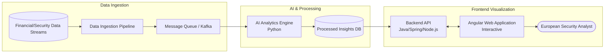

# 👤 Professional Profile: Lorenzo Giarè

This document summarizes my background, core competencies, and unique value proposition for the **Site Reliability Engineering, Google Warsaw** role. This is a personalized "pitch deck" version of my experience, designed to showcase my fit for the division.

---

## 🚀 Why I Am a Great Fit for Site Reliability Engineering at Google Warsaw

### 1. Massively Scalable Systems Experience
I have engineered systems designed for high-concurrency and massive user bases, such as the national institution registry for **FNOMCeO**, built to support **460,000+ users**. I understand the architectural rigor required to ensure that systems remain performant, consistent, fault-tolerant, and secure at a national scale.

### 2. Deep Technical Versatility & Debugging Instinct
My stack spans the entire development lifecycle, which gives me an edge in diagnosing complex issues that span multiple layers:
- **Backend & Systems**: Java (Spring), Python (Node.js/FastAPI), JavaEE, and Linux internals.
- **Infrastructure & Automation**: AWS, Docker, and Kubernetes.
- **Performance**: Edge Inference optimization, demonstrating an understanding of resource-constrained performance tuning and low-latency environments.

### 3. The Bridge Between Research & Production
As a **Researcher in Horizon Europe Projects**, I have a proven track record of taking cutting-edge concepts and translating them into robust, highly-available applications. SRE requires a strong engineering approach to operations, and my research background gives me the analytical rigor to tackle ambiguous, complex failures through data-driven investigation.

### 4. High-Capacity Grit
I have consistently balanced high-level professional responsibilities with academic excellence. I managed full-time engineering roles throughout my Master’s and Bachelor’s degrees, demonstrating the stamina, time-management skills, and incident-response readiness necessary for the fast-paced, high-stakes environment of Google Warsaw's SRE.

---

## 🎤 The "Elevator Pitch"

> "I am a Software Engineer with a deep obsession for building and maintaining intelligent, distributed, and highly reliable systems. My background is unique because I’ve spent the last 5 years building national-scale enterprise architectures while maintaining the analytical rigor of academic research. 
>
> I've built and optimized national registries supporting hundreds of thousands of users, and I treat operations as a software problem. I don't just write code; I architect ecosystems that are observable, fault-tolerant, and performant. I am passionate about Linux internals, automation, and distributed consensus, and I have the engineering maturity to ensure that Google's infrastructure maintains the exceptional reliability that customers expect."

---

## 🛠️ Key Technical Achievements & Project Deep Dives

### 1. FNOMCeO National Registry (Cloud Architecture & High Availability)
**The Project:** Spearheaded the functional design and cloud architecture planning for the National Federation of the Orders of Surgeons and Dentists (FNOMCeO), building a modern, highly available national institution registry capable of supporting over **460,000 users**.

**SRE Relevance:** Demonstrates ability to design, analyze, and troubleshoot large-scale distributed systems. Conducted comprehensive "as-is" architecture assessments and designed the target "to-be" cloud architecture to ensure performance, consistency, and fault-tolerance at a national scale. Designed advanced reporting structures and data pipelines that aggregated massive data without impacting the primary transactional database's performance.

```mermaid
flowchart TD
    User([460k+ Users / Medical Professionals]) --> CDN[CDN / WAF]
    CDN --> LB[Cloud Load Balancer]
    
    subgraph Highly Available Cloud Environment
        LB --> API[API Gateway]
        API --> Auth[Auth Service / JWT]
        
        API --> CoreService[Core Registry Microservices\nJava/Spring/Python]
        API --> ReportService[Reporting & Analytics Service]
        
        CoreService <--> Cache[(Distributed Cache\ne.g., Redis)]
        CoreService <--> DB[(Primary Relational DB\ne.g., PostgreSQL)]
        
        DB -.Replication.-> ReadReplica[(Read Replica)]
        ReadReplica <--> ReportService
    end
    
    classDef cloud fill:#e3f2fd,stroke:#1565c0,stroke-width:2px;
    class Highly Available Cloud Environment cloud;
```

### 2. ARIEN Horizon Europe Project (Data Ingestion & AI Visualization)
**The Project:** ARtificial IntelligencE in fighting illicit drugs production and traffickiNg (ARIEN), a major European security initiative bridging cutting-edge AI research with production-ready applications.

**SRE Relevance:** Developed highly available data ingestion pipelines to process and track complex financial flows and illicit drug trafficking chains in real-time. Engineered a responsive Angular frontend to visualize AI-driven security insights. Showcases the ability to handle ambiguous, complex requirements and translate them into secure, full-stack applications with sensitive data pipelines.



### 3. Edge Inference & Smartwatch Gesture Recognition (Resource Optimization)
**The Project:** Thesis and publication on "Smartwatch Gesture Recognition for Enhancing Personal Security" combined with work on the SmartSense project.

**SRE Relevance:** Highlights deep understanding of performance limitations, capacity planning, and hardware optimization. Developed a multi-head 1D-CNN Deep Learning model for real-time classification of inertial data. Optimized the model using TensorFlow Lite, stripping its memory footprint down to 257.6 KB while maintaining 96% accuracy. Built a robust signal pre-processing pipeline to minimize false positives, demonstrating rigorous capability to debug and optimize code.

```mermaid
flowchart TD
    Sensors((Smartwatch Sensors\nAccelerometer & Gyro)) --> PreProcessing[Signal Pre-processing\nFiltering, Normalization, Windowing]
    
    subgraph On-Device Memory < 258 KB
        PreProcessing --> TFLite[TensorFlow Lite Engine]
        TFLite --> CNN[Quantized 1D-CNN Model]
    end
    
    CNN --> Classifier{Gesture Detected?}
    Classifier -- "Double Fist Clench" --> Action[Trigger SOS / Emergency Protocol]
    Classifier -- "Normal Movement" --> Ignore[Discard / Sleep to Save Power]
    
    classDef edge fill:#e8f5e9,stroke:#2e7d32,stroke-width:2px;
    class On-Device Memory < 258 KB edge;
```

### 4. PREVENT-PCP & NTTDATA (Infrastructure, Benchmarking, & Automation)
*   **PREVENT-PCP:** Engineered a Python-based evaluation framework to benchmark complex security systems, visualizing KPIs through a Streamlit dashboard. Demonstrates analytical rigor and the ability to measure system health logically.
*   **NTTDATA (Zarathustra Integration):** Integrated enterprise software into existing ecosystems using Spring and JavaEE. Architected secure RESTful APIs with JWT authentication and engineered a CV scraping automation tool, showcasing capabilities in automating routine tasks and managing secure integrations.
