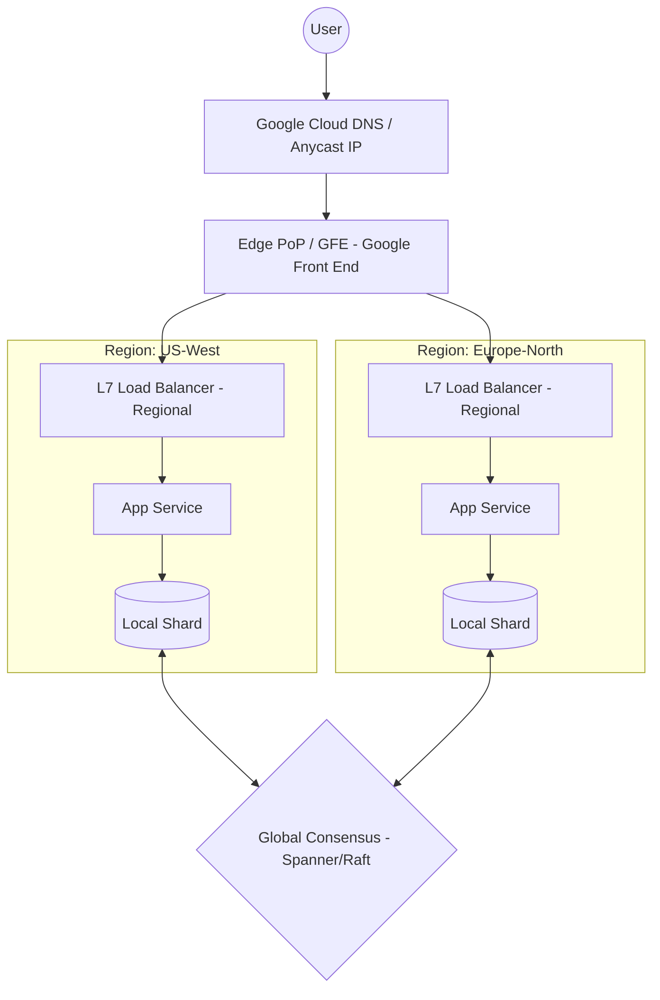

# 🏗️ SRE-Specific System Design (NALSD)

> Site Reliability Engineering at Google relies on **Non-Abstract Large System Design (NALSD)**. This document covers core concepts for designing and running large-scale, fault-tolerant systems.

---

## 📐 The NALSD Framework
When designing systems in an SRE interview, always address:
1.  **Reliability**: How does it fail? Is it 99.9% or 99.999%?
2.  **Scalability**: Can it handle 10x traffic? Where are the bottlenecks?
3.  **Efficiency**: What is the cost per request? (Resource utilization).
4.  **Operability**: Is it easy to monitor and automate? (Toil reduction).

---

## 🌐 Design Challenge 1: Global Load Balancing (GSLB)

### Requirements
- Support 10M+ concurrent users globally.
- Handle total regional outages (e.g., US-EAST-1 goes down).
- Minimize latency by routing users to the nearest healthy datacenter.
- Support "Sticky Sessions" if necessary, but prioritize statelessness.

### Architecture

### Key SRE Considerations
- **Anycast Routing**: Using a single IP to route to the nearest Edge PoP.
- **Health Checking**: Distinguishing between "Service is down" vs "Network is down".
- **Cascading Failures**: Implementing **Priority Tiers** and **Load Shedding** to prevent one region's failure from overloading others.
- **Graceful Degradation**: Serving "stale" data or a "lite" version of the site when under heavy stress.

---

## 📊 Design Challenge 2: Distributed Monitoring System

### Requirements
- Ingest 100M+ metrics per second.
- Support high-cardinality data (e.g., metrics per user/container).
- Real-time alerting (latency < 10s from event to alert).
- Retain data for 1 year with decreasing resolution (downsampling).

### Key Components
1.  **Collector Pool**: Scrapes targets (Pull) or receives telemetry (Push).
2.  **TSDB (Time Series DB)**: Optimized for writes and range queries (e.g., Monarch, Prometheus).
3.  **Rule Engine**: Evaluates SLOs and Error Budgets.
4.  **Alertmanager**: Groups alerts, handles silences, and routes to PagerDuty/Slack.

### The Four Golden Signals
| Signal | Definition | SRE Focus |
|--------|------------|-----------|
| **Latency** | Time taken to service a request. | Monitor P50, P90, and P99. |
| **Traffic** | Demand placed on the system. | HTTP requests/sec, bandwidth. |
| **Errors** | Rate of requests that fail. | 5xx errors, timeouts, malformed data. |
| **Saturation** | How "full" your service is. | CPU, Memory, Disk I/O, Thread pool. |

---

## 🛡️ Design Challenge 3: Reliable Data Pipeline

### Requirements
- Process 1TB of logs/events per hour.
- Zero data loss (At-least-once or Exactly-once delivery).
- Handle bursts of 5x normal traffic.

### Resilience Patterns
- **Message Queues (Pub/Sub)**: Decouples producers from consumers to buffer spikes.
- **Dead Letter Queues (DLQ)**: Captures failed messages for manual triage/replay.
- **Backpressure**: Consumers signal producers to slow down when overwhelmed.
- **Idempotency**: Ensuring that processing the same message twice doesn't cause issues (e.g., duplicate payments).

### MTTR vs MTBF
- **MTBF (Mean Time Between Failures)**: Focus on making the system more robust.
- **MTTR (Mean Time To Recovery)**: Focus on making the system easier to fix (Automation, Rollbacks, Better Observability).
- **SRE Goal**: Optimize for **MTTR** because failures are inevitable in complex systems.

---

## 📝 SRE Design Interview Checklist
- [ ] **Gather Requirements**: What are the SLOs? (Availability/Latency targets).
- [ ] **Back-of-envelope**: Estimate RPS, Bandwidth, and Storage.
- [ ] **Identify Single Points of Failure (SPOF)**: Every component must have a redundant backup.
- [ ] **Discuss Trade-offs**: Consistency vs Availability (CAP Theorem).
- [ ] **Monitoring Strategy**: How will you know if this system is broken?
- [ ] **Automation**: How do you scale this without adding more humans (Toil)?
